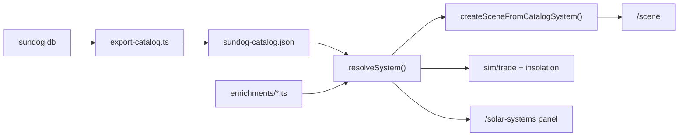

# SunDog enrichment layer

**Status:** implementation spec · **Scope:** authored overlay on the extracted
catalog, scene builder extensions, prototype season/trade readout · **Driver:**
creative planet/system depth for `/solar-systems` and `/scene` without mutating
Tier-0 DB export.

## Three tiers

| Tier | Source | Committed? | Example |
|------|--------|------------|---------|
| **0 extracted** | `scripts/sundog/export-catalog.ts` → `sundog-catalog.json` | yes | `game.trade: 5`, cities, `notes` |
| **1 authored** | `lib/planet/sundog/enrichments/*.ts` | yes | eccentricity, inclination, appearance overrides, flavor |
| **2 generated** | seeded PRNG inside authored ranges | deferred | moon count roll, sparse jovian placement |

Tier 0 is **never hand-edited**. Tier 1 is reviewed in diffs (agent or human).
Tier 2 is documented here but not implemented yet.

## Agent workflow

1. Read extracted `game.notes`, stats, and cities for a system in
   [`sundog-catalog.json`](../../fe/src/lib/planet/sundog/sundog-catalog.json).
2. Edit or add [`fe/src/lib/planet/sundog/enrichments/<system-id>.ts`](../../fe/src/lib/planet/sundog/enrichments/).
3. Run `npm run check && npm test` from `fe/`.
4. Open `/solar-systems` → select system → **Open in Scene** → verify orbits and appearance.

No CLI or in-browser LLM is required for Tier 1.

## Authoring rules

- **Cities / starports:** do not change extracted city names, ids, or starport flags.
- **Provenance:** enrichment records use `kind: 'authored'`.
- **Eccentricity:** `e ∈ [0, 0.35]` unless lore demands more (e.g. Enlie).
- **Multi-planet systems:** each planet gets a **distinct** `periapsisAngle` (≥ ~0.5 rad
  apart). Never leave all periapsides aligned at `0` — avoids a coplanar “spirograph”.
- **Inclination:** tilt the orbital plane via `transform.rotation` on the kepler-orbit
  group node (`{bodyId}-orbit`). The kepler driver still runs in local XZ;
  `periapsisAngle` rotates the ellipse within that plane. See
  [`orbitPlaneRotation.ts`](../../fe/src/lib/planet/sundog/orbitPlaneRotation.ts).

## Enrichment schema

See [`enrichmentTypes.ts`](../../fe/src/lib/planet/sundog/enrichmentTypes.ts).

- **`orbit`:** `eccentricity`, `periapsisAngle` (driver), `inclinationDeg`,
  `ascendingNodeDeg` (kepler-group transform).
- **`appearance`:** optional `preset` + `overrides` (sparse `PlanetParameters`).
- **`gameplay`:** `seasonality`, trade modifiers, `flavor` (UI copy).
- **`additions`:** authored moons / gas giants not in the DB.

`resolveSystem(id)` shallow-merges enrichment onto extracted `SunDogSystem`.
`getSystem(id)` stays extracted-only for export integrity tests.

## Gameplay sim (prototype)

Pure modules under `lib/planet/sundog/sim/`:

- **`orbitPhase`:** mean anomaly from catalog period + scene time.
- **`insolation`:** toy `∝ 1/d(t)²` from kepler distance (uses enrichment `e`).
- **`trade`:** `effectiveTrade(body, system, t)` scales base `game.trade` by season curve.

Full commodity simulation is **out of scope** — see deferred work below.

## Deferred / future work

Not scheduled in the enrichment wave:

- **`scripts/sundog/enrich-llm.ts`** — batch LLM → JSON enrichment (optional accelerator).
- **`generateFromManifest()`** — Tier-2 seeded fill inside authored `generators` ranges.
- **Commodity tables, route graph, multi-system live economy.**
- **In-browser re-enrich API** (server-side key, human review gate).
- **Inclination as kepler driver fields** — node TRS is sufficient for now.
- **Full Keplerian elements** (argument of periapsis separate from node rotation).

## References

- [`sundog-legacy-solar-system-spec.md`](sundog-legacy-solar-system-spec.md) — catalog + galaxy map
- [`scene-routing.md`](scene-routing.md) — composable orbit primitives
- [`celestial-body-params.md`](celestial-body-params.md) — appearance overrides
